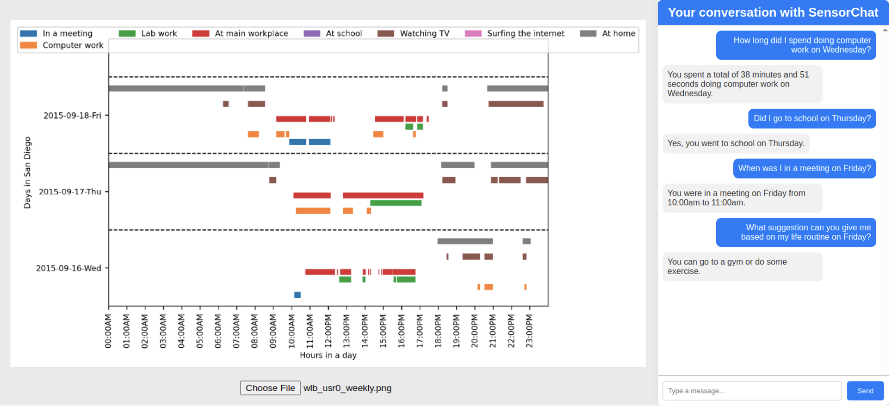

# SensorChat
[IMWUT 2025] SensorChat: Answering Qualitative and Quantitative Questions during Long-Term Multimodal Sensor Interactions [[arXiv link]](https://arxiv.org/abs/2502.02883)

This repo contains the demo of SensorChat based on the [SensorQA dataset](https://github.com/benjamin-reichman/SensorQA).

## File Structure

```
.
├── core                // Core implementation of SensorChat
├── func.py             // Functionality for sensor data query
├── icl_templates       // In-Context Learning templates used in question decomposition
├── LICENSE
├── main_gui.py         // Main demo file using GUI
├── README.md           // This file
├── requirements.txt
├── sensorqa_dataset    // SensorQA dataset
├── static              // GUI design files
├── templates           // GUI design files
└── utils               // Utils files
```

## Prerequisites

We test with Python 3.9. We recommend using conda environments:
```
conda create --name sensorchat-py39 python=3.9
conda activate sensorchat-py39
python3 -m pip install -r requirements.txt
```
All require Python packages are included in `requirements.txt` and can be installed automatically.

### Sensor Embeddings and Question Classification Model

Download the [sensorchat_files.zip](https://drive.google.com/file/d/1RzE2FMK-uBvnYp0Gba4k5JKywDpubx_E/view?usp=sharing) and unzip it into the root directory of this repository:
```
unzip sensorchat_files.zip
```
Make sure all files are placed directly in the root directory. These files include:
* `mlc_embeddings_pred`: predicted sensor data embeddings from [SensorQA](https://github.com/benjamin-reichman/SensorQA)
* `oracle_graphs`: oracle activity graphs from [SensorQA](https://github.com/benjamin-reichman/SensorQA), which can be loaded into the GUI for reference
* `q_model`: trained question classification model
* `api_key.txt`: Contains an OpenAI API key. **Please replace this with your own key to run the demo**

### Finetuned LLM Model
Download the pretrained LLaMA model weights from [Hugging Face](https://huggingface.co/sensorqa/sensist_new_awq) and place all the files in a folder named `sensist_new_awq`.

This model is a quantized version of a fine-tuned LLaMA 2 7B, using [AWQ](https://github.com/mit-han-lab/llm-awq). It requires about 6GB of GPU memory to run.

## Getting Started

### Run the GUI demo

To run the GUI demo, first set the host IP and port in lines 323–324 of `main_gui.py`. In this example, the host IP is `132.239.17.132` and the port is `12345`.

Run the GUI demo for user subject 0 (selectable from 0 to 59) using the AWQ-quantized model with the following command:
```bash
python3 main_gui.py --subject 0 --from_awq
```
Then, open the demo in your browser at: "http://132.239.17.132:12345/". 

In the left panel, you can choose an oracle activity graph for the selected user from the `oracle_graphs` folder. You can also explore graphs focused on specific aspects of daily life. For example, upload `wlb_usr0_weekly.png` to visualize the work-life balance of user #0. Use the right panel for question-answering (QA). Below are some example QA interactions.



### Run the terminal demo
To run the terminal version of the demo for user subject 0 using the AWQ-quantized model, use:
```bash
python3 main_terminal.py --subject 0 --from_awq
```